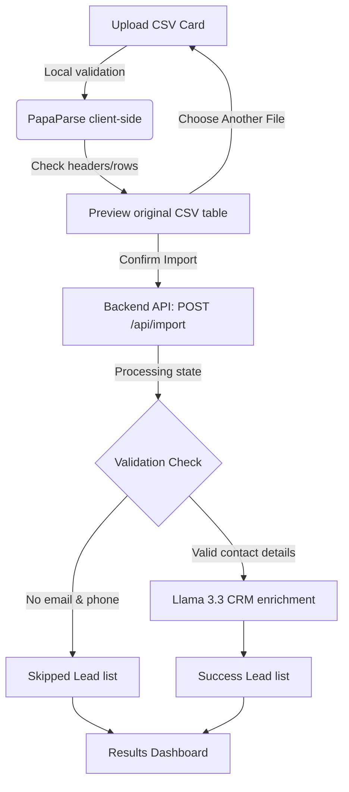

# GrowEasy AI-Powered CSV Importer

An intelligent, SaaS-style lead importer that parses CSV files locally in the browser, previews layouts in real-time, and utilizes a hybrid Rule + AI normalization engine (on the backend via Llama 3.3 on Groq) to enrich, clean, and map records to CRM leads.

---

## 🚀 Key Features

*   **Local CSV Preview**: Parses CSV files on the client side using `PapaParse` to display raw rows, columns, and size metrics prior to any backend transmission.
*   **Drag-and-Drop Uploader**: Built with `react-dropzone` with built-in validation (only accepts `.csv`, max size limit of 20MB).
*   **Validation & Smart Skipping**: A custom backend validation service identifies rows that lack both an email address and a phone number, classifying them as "Skipped" with clear error reasons. This keeps your CRM database clean and saves AI token usage.
*   **Indeterminate Progress Loading**: Displays a modern, purple linear progress loader with rotating status indicators to represent different stages of AI processing.
*   **Comprehensive Results Dashboard**: Showcases statistics cards (Total Processed, Successfully Imported, Skipped), a polished, column-grouped table for successfully enriched CRM leads, and a separate list for skipped row reasons.
*   **Fully Responsive SaaS UI**: Clean slate-colored themes, card boundaries, hover animations, and scrollable grids optimized for mobile, tablet, and desktop viewports.

---

## 📂 Project Structure

```text
growAssignment/
├── backend/                  # Node.js + Express API server
│   ├── src/
│   │   ├── controllers/      # Route controllers (import controller)
│   │   ├── middlewares/      # Multer file upload middlewares
│   │   ├── services/         # Rule & AI processing services
│   │   │   ├── ai.service.js          # Groq model completion queries
│   │   │   ├── batch.service.js       # Splits leads into processable API batches
│   │   │   ├── csv.service.js         # Parses CSV file buffer streams
│   │   │   ├── header.service.js      # Analyzes CSV column names
│   │   │   ├── import.service.js      # Main workflow coordinator pipeline
│   │   │   ├── mappingServices.js     # Rule-based header dictionary matcher
│   │   │   ├── transform.service.js   # Maps raw records to CRM target schemas
│   │   │   └── validation.service.js  # Validates and flags skipped lead rows
│   │   ├── routes.js         # API Route definitions (/api/import)
│   │   └── server.js         # Port listener configuration
│   └── .env                  # Port and API keys
│
└── frontend/                 # Next.js (App Router) client app
    ├── src/
    │   ├── app/              # Page layouts & router context
    │   ├── components/       # SaaS dashboard parts
    │   │   ├── layouts/      # Header, dynamic Stepper, wrappers
    │   │   ├── upload/       # Dropzone uploader card
    │   │   ├── preview/      # CSV Preview stats & structures
    │   │   ├── import/       # Indeterminate loading spinners
    │   │   └── result/       # Summaries, success tables, skipped tables
    │   ├── hooks/            # Custom hooks (useCsvParser, useImport)
    │   ├── services/         # Axios network uploads
    │   ├── lib/              # Axios instance setup
    │   └── utils/            # Byte size formatting helpers
    └── package.json
```

---

## 🛠️ Getting Started

### Prerequisites
Make sure you have [Node.js](https://nodejs.org/) installed (v18+ recommended).

### 1. Set Up the Backend
1. Open a terminal in the `backend/` directory:
   ```bash
   cd backend
   ```
2. Install dependencies:
   ```bash
   npm install
   ```
3. Make sure your `.env` file in the `backend` folder contains the required environment variables:
   ```env
   PORT=5000
   GROQ_API_KEY=your_groq_api_key_here
   ```
4. Start the backend development server:
   ```bash
   npm start
   ```
   The backend will launch at `http://localhost:5000`.

### 2. Set Up the Frontend
1. Open a new terminal in the `frontend/` directory:
   ```bash
   cd ../frontend
   ```
2. Install dependencies:
   ```bash
   npm install
   ```
3. Start the Next.js development server:
   ```bash
   npm run dev
   ```
4. Open [http://localhost:3000](http://localhost:3000) in your web browser.

### 3. Run with Docker (Single Command)
If you have Docker installed, you can spin up both services with a single command from the root directory:
1. Run:
   ```bash
   docker compose up --build
   ```
2. Once up:
   * Access the Importer Frontend at: [http://localhost:3000](http://localhost:3000)
   * Access the backend at: [http://localhost:5000](http://localhost:5000)

---

## 📋 Importer Flow



1.  **Upload Phase**: The user uploads a CSV file. The file format and size are validated instantly.
2.  **Preview Phase**: The spreadsheet parses the raw columns. You can preview columns, inspect headers, and check row lengths locally without hitting the backend.
3.  **Normalizing & Extraction (Step 3)**: Clicking **Confirm Import** sends the original File buffer as multipart data. The backend maps headers (aligning custom headers like "Mail" and "WhatsApp" to "email" and "mobile_without_country_code"), runs contact checks, and executes model inferences.
4.  **Results (Step 4)**: The successful dashboard displays enriched CRM data records, highlighting skips and formatting location lists.

---

## 📝 Sample Data Included
You can find test files inside the `backend/` folder to run trial imports:
*   `backend/sample-test-records.csv`: Features standard headers, multiple contacts (emails/phones), missing columns, and a completely blank contact row (`Vikram Joshi`) to test the skipped leads pipeline.
*   `backend/test-data2.csv`: Uses complex/custom header aliases (`Client`, `Mail`, `WhatsApp`, `Organization`, `HQ`, `Region`, `Assigned Agent`, `Lead Journey`, `Site`, `Internal Remarks`, `Handover`, `Additional Details`) to test Rule-based and AI-based header mapping functionality.
